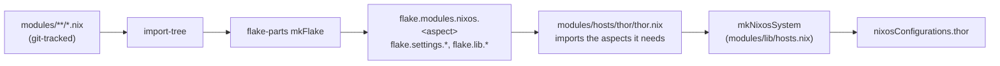

# Dendritic architecture

How this repository is built: one file per concern, auto-loaded, merged by
the NixOS module system rather than wired together by hand.

The governing idea: **organize by what a thing does, not by where it runs
or what category it belongs to.** `modules/blocky.nix` holds Blocky's DNS
config, its Prometheus scrape job, its Grafana datasource, and its firewall
rule — everything Blocky needs, in one file — rather than splitting those
four concerns across `services/`, `monitoring/`, and `networking/`
directories that only make sense if you already know how they connect. This
is the [dendritic pattern](https://github.com/mightyiam/dendritic); see
[Credits](../README.md#credits) for the reference implementations this
config draws from.

## The mechanism

`flake.nix` does almost nothing itself:

```nix
outputs = inputs @ {flake-parts, import-tree, ...}:
  flake-parts.lib.mkFlake {inherit inputs;} (import-tree ./modules);
```

[`import-tree`](https://github.com/vic/import-tree) walks `modules/`,
collects every `.nix` file, and hands the list to
[flake-parts](https://github.com/hercules-ci/flake-parts) as its module
list. Each file is a small flake-parts module — a function of `{inputs,
lib, config, ...}` returning an attrset — and flake-parts merges all of
them the same way the NixOS module system merges any set of modules: by
option, not by file.

Two conventions on top of that:

- **Auto-loading is git-tracked only.** A new `.nix` file does nothing
  until `git add`-ed — draft a module, leave it unstaged, and it is
  invisible to the build. This is the safety net that makes blanket
  auto-loading tolerable.
- **A leading underscore opts a file out of auto-loading.** `_hardware.nix`
  and `_rollback.nix` in `modules/hosts/thor/` are tracked but not picked
  up by `import-tree` — they're wired in explicitly by `thor.nix` instead.
  Reserved for host-specific config that must never accidentally apply
  somewhere else. The full convention is documented in
  [`modules/hosts/thor/README.md`](../modules/hosts/thor/README.md#underscore-prefix-convention).



## Aspects

Most files declare one `flake.modules.nixos.<name>` attribute — an
**aspect**: a self-contained NixOS module for one piece of functionality.
[`modules/blocky.nix`](../modules/blocky.nix) is a representative example —
one file owns:

- the service config (`services.blocky`)
- its Postgres query-log database (imports the shared `postgresql` aspect)
- its Prometheus scrape job
- its Grafana datasource
- the firewall ports it needs open

Nothing outside this file knows or needs to know that Blocky exists, except
whatever imports the `blocky` aspect by name. Compare that to a
layered layout where the same four concerns live in `services/blocky.nix`,
`monitoring/scrape-configs.nix`, `monitoring/dashboards.nix`, and
`networking/firewall.nix` — deleting Blocky there means hunting across
four directories; here it means deleting one file (and removing it from
whatever import list references it).

Aspects are composed by importing other aspects by name, resolved off
`inputs.self.modules.nixos`:

```nix
# modules/media/media.nix — an aspect that is just a bundle of aspects
flake.modules.nixos.media.imports = with inputs.self.modules.nixos; [
  bazarr jellyfin lidarr navidrome prowlarr radarr sabnzbd
  seerr slskd sonarr soularr transmission dlna
];
```

`modules/common.nix` does the same for the small set of aspects every host
wants (`ssh`, `docker`, `nix`, `user`, …), and
[`modules/hosts/thor/thor.nix`](../modules/hosts/thor/thor.nix) lists the
rest thor specifically needs. `modules/lib/hosts.nix` builds
`nixosConfigurations.thor` from `common`, `home-manager`, `interfaces`
(below), and the host's own aspect — see `mkNixosSystem`.

## Cross-aspect options: how aspects talk without depending on each other

Aspect files are meant to be independent, but some information has to flow
between them — Grafana needs to know what dashboards exist; blackbox-exporter
needs to know what to probe. Rather than have `grafana.nix` import every
service aspect (or every service aspect check `config.services.grafana.enable`
before writing to it), [`modules/interfaces.nix`](../modules/interfaces.nix)
declares the shared options up front:

```nix
options.monitoring.dashboards = lib.mkOption {
  type = lib.types.attrsOf lib.types.path;
  default = {};
  description = "Grafana dashboard JSON keyed by filename stem; each module appends the dashboard for the metrics it owns.";
};
```

`interfaces` is always in the base module list (`modules/lib/hosts.nix`),
so `config.monitoring.dashboards` exists on every host whether or not
Grafana is imported. Any aspect can append to it —
`monitoring.dashboards.blocky = ./dashboards/blocky.json;` — with no
dependency on the consumer, and `grafana.nix` reads the merged attrset with
no dependency on any producer. Same pattern for `monitoring.probeTargets`
(blackbox-exporter targets) and `homepage.services` (dashboard tiles). This
is what keeps aspects decoupled: producers and consumers only share an
option name, never a file reference.

The other half of avoiding repetition across aspects is shared functions in
`modules/lib/` — `mkProxiedService` (nginx vhost + homepage tile + probe
target, in one call) and `mkArr` (the *arr-family boilerplate built on top
of it) turn what would be four or five repeated blocks per service into one
function call. See [`modules/lib/proxy.nix`](../modules/lib/proxy.nix) and
[`modules/lib/servarr.nix`](../modules/lib/servarr.nix).

## Shared settings

Values more than one aspect needs — ports, the domain name, the primary
user — are declared as options too, under `flake.settings`, in
`modules/settings/`:

```nix
# modules/settings/server.nix
options.flake.settings.server.domain = lib.mkOption {
  type = lib.types.str;
  default = "greensroad.uk";
};
```

read back elsewhere as `inputs.self.settings.server.domain`. This is a
single source of truth in the sense that matters for a dendritic layout —
not one file that knows about every service, but one option every service
can point at instead of hardcoding a port or a domain locally.

## The `key` escape hatch

The NixOS module system treats two imports of the same file as the same
module and merges them once; two imports of an *attrset literal* (or of a
module returned by a function called twice) look different and get merged
twice, which trips list-typed options like impermanence's persistence list.
`modules/postgresql.nix` is imported from both `blocky.nix` and
`immich.nix`, so it sets an explicit `key` to tell the module system these
are the same module:

```nix
flake.modules.nixos.postgresql = {
  key = "postgresql-aspect";
  services.postgresql.enable = true;
  environment.persistence."/persist".directories = ["/var/lib/postgresql"];
};
```

Needed only for aspects imported from more than one place that also set a
list-typed option — most aspects never need it.

## Why this shape

- **Adding a service is additive.** One new file under `modules/`, added to
  one import list. Nothing else in the tree has to change.
- **Removing a service is (mostly) one deletion**, not a hunt across
  service/monitoring/networking directories for its leftover pieces.
- **Git-tracking-as-safety-switch** means a module can be drafted in place
  and left inert until it's ready to `git add`.
- **Cross-aspect options keep the dependency graph flat.** Aspects declare
  what they produce or consume through `modules/interfaces.nix`, never by
  reaching into another aspect's file.

The cost is that "what does thor actually run" isn't visible from a single
file — it's the union of `common`, `thor.nix`'s import list, and whatever
those aspects pull in transitively. `modules/hosts/thor/README.md` and the
root [README](../README.md#project-structure) are the closest things to a
map; `nix flake check` is the way to find out if the union actually
evaluates.
