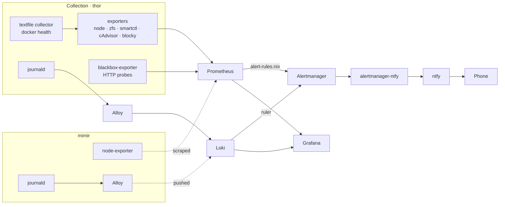

# Monitoring

Everything thor knows about itself and about mimir, and how a failure becomes a
phone notification. The stack spans a dozen modules; this is the map.

thor is the hub: it runs Prometheus, Loki, Grafana and Alertmanager, scrapes its
own exporters and mimir's, and receives mimir's logs. mimir runs only the two
agents that feed thor — node-exporter and Alloy. Nothing monitoring-related is
duplicated on mimir, and mimir has no Grafana of its own.

This page is the design reference — why the pipeline is shaped this way and
what each alert exists to catch. If one has just fired and you want to know what
to type, start at [troubleshooting.md](troubleshooting.md).

The governing rule: **every failure class must reach ntfy**. A dashboard nobody
is looking at is not monitoring. Signals that only feed a dashboard are called
out as such in [Deliberate omissions](#deliberate-omissions).

## Pipeline



Everything but the mimir box runs on thor. The two dotted edges are the only
cross-host traffic: thor **pulls** mimir's metrics, mimir **pushes** its logs.
Metrics are pulled because Prometheus owns the target list; logs are pushed
because Loki has no scraper. Both cross `tailscale0`.

Two rule engines, one Alertmanager. Prometheus evaluates metric rules; Loki's
ruler evaluates log rules and posts to the same Alertmanager, so both arrive
through the same ntfy topic with the same formatting.

## Collection

### Scrape jobs

Global `scrape_interval` 15s, `retention` 30d (`modules/prometheus.nix`). Each
job is declared by the module that owns the thing being scraped, not centrally.

| Job | Target | Declared in | Covers |
|---|---|---|---|
| `prometheus` | `127.0.0.1:9090` | `prometheus.nix` | rule evaluation, TSDB health |
| `alertmanager` | `127.0.0.1:9093` | `alertmanager.nix` | notification delivery success/failure |
| `grafana` | `127.0.0.1:3000` | `grafana.nix` | dashboard server |
| `loki` | `127.0.0.1:3100` | `loki.nix` | log ingestion rates |
| `alloy` | `127.0.0.1:12345` | `hosts/thor/alloy.nix` | the log shipper itself |
| `blocky` | `127.0.0.1:4000` | `blocky.nix` | DNS queries, blocklists, cache |
| `node-exporter` | `thor:9100` | `hosts/thor/node-exporter.nix` | CPU, memory, filesystems, hwmon, **systemd unit states**, textfile |
| `node-exporter-mimir` | `mimir:9100` | `hosts/thor/mimir-scrape.nix` | the same, for mimir — no hwmon (it is a VM) or textfile |
| `zfs-exporter` | `thor:9134` | `hosts/thor/zfs-exporter.nix` | pool health, dataset usage |
| `smartctl-exporter` | `thor:9633` | `hosts/thor/smartctl-exporter.nix` | per-drive SMART attributes |
| `cadvisor` | `127.0.0.1:9338` | `hosts/thor/container-metrics.nix` | per-container CPU, memory, start time |
| `blackbox-exporter` | `127.0.0.1:9115` | `hosts/thor/blackbox-exporter.nix` | the prober itself |
| `blackbox-http` | every `monitoring.probeTargets` entry | `hosts/thor/blackbox-exporter.nix` | end-to-end HTTP reachability |

`node-exporter` runs the `systemd` collector, which is what makes
`node_systemd_unit_state` — and therefore per-unit failure alerting — possible
without parsing logs. mimir runs it too, so `SystemdUnitFailed` and
`MonitoringUnitDown` cover mimir's units — including its own `alloy.service`,
which is what stops mimir's log shipping from failing silently.

Both hosts are reached over `tailscale0`, which is the only entry in
`networking.firewall.trustedInterfaces` (`modules/networking.nix`, applied to
every host through `common`). That is why neither the scrape of `mimir:9100` nor
mimir's push to thor's Loki needs a firewall rule on either side.

### HTTP probes

Services do not register themselves with the prober. They contribute a URL to
`monitoring.probeTargets` (declared in `modules/interfaces.nix`), and
`mkProxiedService` does it for them (`modules/lib/proxy.nix`). Two conventions
matter:

- **Keyed by display name.** The attribute key becomes the probe's `instance`
  label, so alerts read `Prowlarr`, not `http://127.0.0.1:9696`. The probed URL
  survives as a separate `target` label — set by a relabel rule that has to run
  *before* `__address__` is rewritten to the exporter.
- **`probePath` aims at a health endpoint** where one exists without an API key
  (`/api/health`, `/healthcheck`, `/v1/health`). Probing `/` only proves
  something is listening, which a service whose database won't open will
  happily keep doing — exactly the Bar Assistant failure.

Two services set `monitoring.probeTargets` directly rather than through
`mkProxiedService`: Bar Assistant, which needs subpath routing across three
backends and whose *API* is the component worth probing rather than its static
frontend; and Homepage, which is the dashboard the service tiles live on and so
has no tile of its own to generate.

Probes run every 60s, redirects followed, IPv4, 10s prober timeout inside a 15s
scrape timeout.

### Container health

cAdvisor reports resource usage and start times but not Docker's `HEALTHCHECK`
verdict, and node-exporter has no Docker collector. So
`hosts/thor/container-metrics.nix` runs a 30s timer that renders `docker
inspect` into the textfile collector at
`/var/lib/prometheus-node-exporter-textfile/docker-health.prom`:

| Metric | Meaning |
|---|---|
| `docker_container_running{name}` | 1 while the container runs; 0 when it exists but is stopped |
| `docker_container_health_status{name,status}` | 1 on the current state, 0 on the others; absent for images that declare no healthcheck |

Every health state is emitted rather than just the live one, so recovery
resolves on the next scrape instead of waiting ~5m for the old series to go
stale. If the Docker daemon is unreachable the script fails the unit rather
than publishing zeroes — that raises `SystemdUnitFailed`, and the frozen file
mtime raises `ContainerHealthCollectorStale`.

`docker_container_running` is the only signal covering containers started
outside Nix (via Portainer): they have no systemd unit, so nothing else watches
them. Nix-declared containers are covered by their unit instead — stopping one
runs `oci-containers`' post-stop hook, which `docker rm -f`s it, so it leaves
the metric set rather than lingering at 0.

All of the above is thor-only and Docker-only. mimir runs the download stack
under **podman**, which neither cAdvisor nor `docker inspect` is pointed at
here, so the `container-health` group covers none of those nine services. They
are not unmonitored — thor's blackbox probes reach them through nginx, so
`ProbeFailed` still catches one that stops serving. What is missing is the
*reason*: a restart loop, a failed healthcheck, or per-container resource use.
See [Deliberate omissions](#deliberate-omissions).

### Logs

Alloy reads the systemd journal (12h max age) and pushes to Loki, relabelling
`unit`, `hostname` and `level` out of journal fields. Loki keeps 30 days.

Both hosts run their own Alloy and push to the same Loki on thor
(`hosts/thor/alloy.nix`, `hosts/mimir/alloy.nix`) — logs are pushed, never
scraped. Each tags its stream with a static `host` label (`thor` or `mimir`)
alongside the shared `job="systemd-journal"`. That label is the only thing
separating the two hosts downstream, so it matters in three places: the log
alert rules in `modules/loki.nix` all aggregate `sum by (host)`, the
`system-errors-warnings` dashboard filters and groups on it, and any ad-hoc
Explore query wanting one host needs `{job="systemd-journal", host="mimir"}`.
Omit it and you get both hosts silently merged.

Log rules live in `modules/loki.nix` and are written to
`/srv/loki/rules/fake/log-alerts.yml` (`fake` being the tenant when
`auth_enabled = false`). Note the `L+` tmpfiles rule there: plain `L` only
creates the symlink when the path is absent, so rule edits silently stop
deploying after the first build. That was a live bug.

## Alerting

Metric rules are in `modules/alert-rules.nix`, one YAML block, grouped. Log
rules are in `modules/loki.nix`. Both fire into Alertmanager.

### Metric alerts

| Group | Alert | Sev | Fires when |
|---|---|---|---|
| `host-health` | `HostHighCpuTemperature` | crit | CPU >80°C for 5m |
| | `HostHighCpuTemperatureWarn` | warn | CPU >72°C for 10m |
| | `HostMemoryAlmostFull` | crit | <10% available for 10m |
| | `HostMemoryHighUsage` | warn | <20% available for 15m |
| | `HostFilesystemAlmostFull` | crit | <10% free for 10m |
| | `HostFilesystemFillingUp` | warn | <20% free for 30m |
| | `MergerfsLowFreeSpace` | warn | pool <100 GiB free for 30m |
| | `HostFanStopped` | crit | chassis fan at 0 RPM for 2m |
| | `InstanceDown` | crit | a scrape target unreachable 5m (probes excluded) |
| `storage-health` | `ZfsPoolNotOnline` | crit | pool not ONLINE |
| | `SmartUnhealthy` | crit | drive declares overall SMART failure |
| | `SmartTemperatureHigh` | warn | drive >55°C for 10m |
| | `SmartSectorErrors` | warn | reallocated/pending/uncorrectable sectors non-zero — the early warning `SmartUnhealthy` is too late for |
| `dns-health` ([blocky.md](blocky.md)) | `BlockyResolutionErrors` | crit | resolution failing, usually Mullvad unreachable |
| | `BlockyListDownloadsFailing` | warn | blocklist downloads failing — Blocky keeps serving, so blocking degrades silently |
| | `BlockyListRefreshStale` | warn | lists >48h old |
| `probe-health` | `ProbeFailed` | crit | a service's HTTP probe fails 5m — unreachable, non-2xx, or hung while its unit stays active |
| | `ProbeSlow` | warn | probe >5s for 10m |
| `container-health` | `ContainerUnhealthy` | crit | Docker `HEALTHCHECK` failing 5m while the unit stays active |
| | `ContainerRestartLoop` | crit | >3 restarts in 15m |
| | `ContainerStopped` | warn | container still exists but hasn't run for 10m — in practice a non-Nix one, see [Container health](#container-health) |
| | `ContainerHealthCollectorStale` | warn | the health textfile is >10m old |
| `monitoring-health` | `MonitoringUnitDown` | crit | prometheus, alertmanager, alertmanager-ntfy, loki, grafana or alloy not active |
| | `SystemdUnitFailed` | crit | any unit in `failed` for 5m, named |
| | `AlertmanagerNotificationsFailing` | crit | the ntfy webhook has been erroring 5m |
| | `LogIngestionStopped` | crit | Loki received nothing for 15m — Alloy up but shipping nothing would silently disable every log rule |
| | `PrometheusRuleEvaluationFailures` | warn | a rule expression is broken |

### Log alerts

Evaluated by Loki's ruler every 1m over the journal.

| Alert | Sev | Fires when |
|---|---|---|
| `SystemdUnitCrashLooping` | crit | >2 "failed with result"/non-zero exits in 5m — catches `Restart=always` units that never settle into `failed` |
| `OomKill` | crit | the OOM killer ran |
| `ZfsKernelError` | crit | ZFS logged an error, degradation, fault or corruption |
| `KernelHardFault` | crit | kernel panic, hard lockup or machine check exception |
| `SystemdCoredump` | warn | systemd-coredump recorded a crash |

### Severity

`critical` means acting now; `warning` means headroom is shrinking. The
difference is not cosmetic — it drives repeat cadence, ntfy priority and
inhibition.

### Routing and delivery

`modules/alertmanager.nix`: grouped by `alertname` + `instance` + `severity`,
30s group wait, 5m group interval, repeat every 12h — or 4h for `critical`.
A firing `critical` inhibits a `warning` sharing the same alertname and
instance, so a filesystem crossing both thresholds pages once.

Delivery is a webhook to `alertmanager-ntfy` (`modules/alertmanager-ntfy.nix`),
which posts to `https://ntfy.greensroad.uk`:

| | |
|---|---|
| Priority | `urgent` for critical, `high` otherwise |
| Tags | 🚨 firing critical · ⚠️ firing warning · ✅ resolved |
| Title | `[Resolved] AlertName on instance` |
| Body | the alert's `summary`, then `description` |
| Topic | `thor` |

`send_resolved` is on, so every alert is followed by its recovery. The topic
is a plain string in the Nix store, not a secret: ntfy is only reachable
through the cloudflared tunnel and the tailnet, both already auth-gated, so
the topic name isn't what protects it.

## What catches what

The point of the whole arrangement. Each row is a way thor can fail and the
signal that turns it into a notification.

| Failure | Caught by |
|---|---|
| Unit exits and systemd gives up | `SystemdUnitFailed` (metrics, per-unit) |
| Unit crash-loops without settling | `SystemdUnitCrashLooping` (journal) |
| Monitoring component stops | `MonitoringUnitDown` |
| Exporter unreachable | `InstanceDown` |
| **App up but serving nothing** — process alive, port bound, requests failing | `ProbeFailed` against a health endpoint |
| App slow | `ProbeSlow` |
| **Container active but failing its healthcheck** | `ContainerUnhealthy` |
| Container restart-looping | `ContainerRestartLoop` |
| Container stopped and forgotten | `ContainerStopped` |
| Container deliberately removed | *nothing, by design* — the metrics leave with it |
| Host out of memory, disk, or cooling | `host-health` group |
| Drive degrading | `SmartSectorErrors` early, `SmartUnhealthy` late, `ZfsPoolNotOnline`, `ZfsKernelError` |
| Process OOM-killed | `OomKill` |
| Kernel panic / lockup / MCE | `KernelHardFault` |
| DNS broken or blocking degraded | `dns-health` group — see [blocky.md](blocky.md) |
| Alert delivery itself broken | `AlertmanagerNotificationsFailing`, `LogIngestionStopped`, `PrometheusRuleEvaluationFailures`, `ContainerHealthCollectorStale` |
| mimir down, or the microvm stopped | `InstanceDown` on `node-exporter-mimir` |
| mimir's log shipping stops | `MonitoringUnitDown` on its `alloy.service` |
| **thor down, unpowered, or off the network** | *nothing* — see [Deliberate omissions](#deliberate-omissions) |

The two bold rows are the failure classes that motivated issue #192: both leave
systemd perfectly happy.

## Dashboards

Provisioned read-only from `modules/dashboards/` — `node-exporter-full`,
`host-comparison`, `cadvisor`, `smartctl`, `storage-health`, `blackbox-http`,
`blocky`, `blocky-query`, `system-errors-warnings`. Each is contributed by the
module owning the metrics it displays. See [dashboards.md](dashboards.md).

The two node dashboards split by question. **Host Comparison** puts every host
on one screen and answers *which* host is unhappy; **Node Exporter Full** is the
vendored per-host deep dive that answers *why*, one host at a time via its `job`
dropdown. That split is deliberate — see [dashboards.md](dashboards.md) for why
Node Exporter Full was left single-host.

## Runbook

This section debugs the monitoring pipeline itself. To debug the *service* an
alert is complaining about, see [troubleshooting.md](troubleshooting.md).

Only Grafana has a vhost (`grafana.greensroad.uk`, through the tunnel).
Prometheus binds `0.0.0.0:9090` but its port is not opened in the firewall, so
it is reachable from the tailnet and the host only. Alertmanager binds
`127.0.0.1:9093` — on thor itself, or over an SSH tunnel, and nowhere else.

```sh
# What is firing right now
curl -s 'localhost:9090/api/v1/query?query=ALERTS{alertstate="firing"}' \
  | jq -c '.data.result[].metric'

# Are all targets up?
curl -s localhost:9090/api/v1/targets \
  | jq -r '.data.activeTargets[] | select(.health!="up") | .labels.job, .lastError'

# Did the rules load?
curl -s localhost:9090/api/v1/rules | jq -r '.data.groups[].name'

# Container health, as published
sudo systemctl start docker-health-textfile.service
cat /var/lib/prometheus-node-exporter-textfile/docker-health.prom

# Probe one service by hand, as the prober sees it
curl -s 'localhost:9115/probe?module=http_2xx&target=http://127.0.0.1:3000/api/health' \
  | grep -E '^probe_(success|http_status_code|duration_seconds)'

# Log rules actually deployed (the symlink is the usual suspect)
sudo ls -l /srv/loki/rules/fake/
```

Silences are runtime state in Alertmanager, not config in this repo, so one
survives a rebuild but not a state wipe. From thor:

```sh
nix shell nixpkgs#prometheus-alertmanager -c amtool \
  --alertmanager.url http://127.0.0.1:9093 silence add \
  alertname=ContainerStopped name=soularr --duration 2h --comment "planned"
```

Adding things:

- **A probe** — nothing to do if the service uses `mkProxiedService`; set
  `probePath` if it has a health endpoint. Otherwise assign
  `monitoring.probeTargets."Display Name"` in the service's own module.
- **A rule** — `modules/alert-rules.nix` for metrics, `modules/loki.nix` for
  logs. `nix flake check` only proves the YAML is a string, so check the
  PromQL before rebuilding:

  ```sh
  nix eval --impure --raw .#nixosConfigurations.thor.config.services.prometheus.rules \
    --apply 'r: builtins.elemAt r 0' > /tmp/rules.yml
  nix shell nixpkgs#prometheus.cli -c promtool check rules /tmp/rules.yml
  ```

- **A dashboard** — see [dashboards.md](dashboards.md).

Alerts are best verified by causing one. Stopping a container trips
`ProbeFailed` at 5m and `ContainerStopped` at 10m, and starting it again should
produce two resolved notifications.

## Deliberate omissions

- **Nothing watches thor itself.** thor watches thor and mimir, but mimir is a
  guest thor hypervises, so it is not an independent observer: if thor loses
  power or network, both hosts and the whole alert pipeline go down together and
  nothing notifies. Issue #132 tracks moving a copy of the stack onto a
  Raspberry Pi, which is the only real fix.
- **No container-level monitoring of the download stack.** It runs under podman
  on mimir; cAdvisor and the `docker inspect` textfile collector are thor-only
  and Docker-only, so `ContainerUnhealthy`, `ContainerRestartLoop` and
  `ContainerStopped` cover nothing there. Blackbox probes catch a service that
  stops answering, which is the outcome that matters; the cause has to come from
  the logs.
- **Homepage's `siteMonitor` tiles are dashboard-only.** They colour a tile and
  alert nobody. During the Bar Assistant incident the tile pinged the healthy
  frontend while the API was dead, and looked fine throughout. Blackbox probes
  exist because of this.
- **uptime-kuma and the nginx exporter were removed, not fixed** — the probes
  cover the first, and nothing consumed the second.
- **No per-container CPU/memory alerts.** No container has resource limits set,
  so any threshold would be invented rather than derived; host-level memory
  pressure and `OomKill` cover the outcome that matters.
- **No alerting on Grafana itself beyond liveness.** Grafana renders data it
  does not own; a Grafana outage costs visibility, not service.
